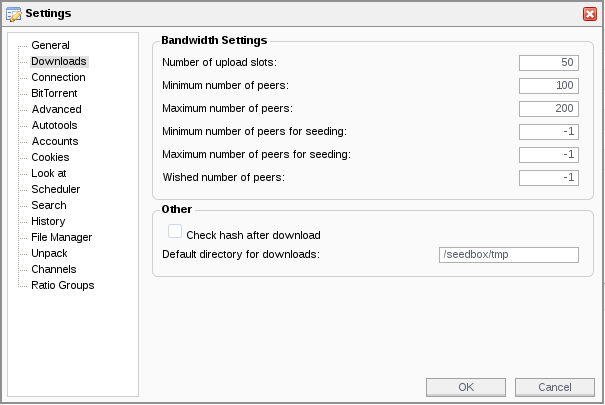

# Configuration

## Configuration file

You can use the example configuration file. This file can be located in:

* /usr/local/etc/ (pip install)
* ~/.local/etc/ (pip install in user privileges)
* /opt/llaumgui/seedboxsync (clone repository)

```bash
sudo cp /usr/local/etc/seedbox.ini.dist /etc/seedbox.ini
```

You can put your configuration in:

* seedboxsync.ini in the root of the sources folder.
* ~/.seedboxsync/seedboxsync.ini
* /usr/local/etc/seedboxsync.ini
* /usr/local/etc/seedboxsync/seedboxsync.ini
* /etc/seedboxsync.ini
* /etc/seedboxsync/seedboxsync.ini

## Settings

### Configuration about your seedbox and your BitTorrent client

* First, set informations about the connection to your Seedbox. Currently, only sftp is supported.

```ini
[Seedbox]

# Informations about your seedbox connection
transfer_host=my-seedbox.net
transfer_port=22
transfer_login=me
transfer_password=p4sw0rd

# For the moment, only sftp
transfer_protocol=sftp
```

* To prevent some issues between your transfer account and your BitTorrent client account, SeedboxSync chmod torrent file after upload.

```ini
# Chmod torrent after upload (false = disable)
# Use octal notation like https://docs.python.org/3.4/library/os.html#os.chmod
transfer_chmod=0o777
```

* To prevent that your BitTorrent client watch (and use) an incomplete torrent file, SeedboxSync transfer torrent file in a tmp directory (tmp\_path) and move it in the watch folder after full transfert and chmod. The tmp folder must also be used in your BitTorrent client to download unfinished torrent.



```ini
# Use a tempory directory (you must create it !)
tmp_path=/tmp
```

* The blackhole folder of your BitTorrent client. Only used by blackhole synchronisation.

```ini
# Your "watch" folder you must create it!)
watch_path=/watch
```

* The folder of your Bittorrent client with finished file. You can configure your client to move finished file in a specific folder.


```ini
# Your finished folder you must create it!)
finished_path=/files
```

* You can remove a prefix part of the path in your synced directory.

```ini
# Allow to remove a part of the synced path. In General, same path than "finished_path".
prefixed_path=/files
```

* You can also specified extension used by your torrent client for downloads in progress to exclude it from synchronisation.

```ini
# Exclude part files
part_suffix=.part
```

* You can also exclude files from sync with regular expression.

```ini
# Exclude pattern from sync
# Use re syntaxe: https://docs.python.org/3/library/re.html
# Example: .*missing$|^\..*\.sw
```